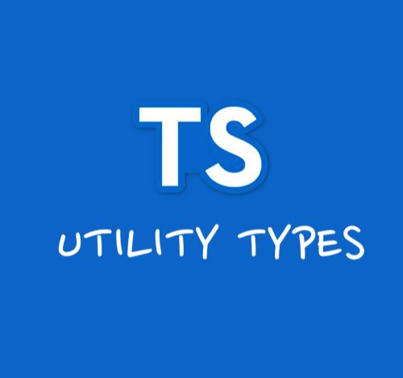

<p align="center">
  
  <h1 align="center">ts-typekit</h1>
  <p align="center">🧰 Collection of TypeScript utility types</p>
  <p align="center">
    <a href="https://www.npmjs.com/package/ts-typekit" title="View this project on NPM">
      
    </a>
    
    
    <a href="/package.json"></a>
  </p>
</p>

- **No Runtime Cost**: ts-typekit operates exclusively at compile-time, meaning it introduces zero overhead to your runtime performance.

- **Battle-tested**: All utility types within ts-typekit are rigorously tested using tsd, providing you with confidence and reliability in their usage.

- **Type Safety**: By leveraging ts-typekit, you can enforce stricter type checks, reducing the likelihood of type-related errors and improving the overall robustness of your TypeScript applications.

Whether you're dealing with complex type transformations, conditional types, or need to enforce specific type constraints, ts-typekit has you covered with a growing collection of utility types that cater to a variety of common and advanced use cases.

## Install

```ts
npm install ts-typekit
yarn add ts-typekit
```

Requires TypeScript >= 5.1

## Usage

```ts
import type { StrictOmit } from 'ts-typekit';

type User = {
  id: number;
  name: string;
};

type UserWithoutId = StrictOmit<User, 'id'>; // { name: string }
```

## Tip

Recommend working with the **{strict: true}** option in tsconfig.

If your team is using ESLint and wants to enforce the use of **StrictOmit** instead of the standard **Omit**, you can configure ESLint to help catch this. The **@typescript-eslint/ban-types** rule can be configured to display an error message when Omit is used, guiding developers to use StirctOmit instead. Here's how you can set up your ESLint configuration:

```js
module.exports = {
  parser: '@typescript-eslint/parser',
  plugins: ['@typescript-eslint'],
  rules: {
    // Include other relevant rules here
    '@typescript-eslint/ban-types': [
      'error',
      {
        types: {
          Omit: 'Use StrictOmit instead', // write the error message.
        },
        extendsDefaults: true,
      },
    ],
  },
};
```

## Contributing

Read below for detailed contribution guide.

[CONTRIBUTING](https://github.com/haejunejung/ts-typekit/blob/main/.github/CONTRIBUTING.md)

## Contributors

Thanks for considering contributing to ts-typekit.

<!-- readme: contributors -start -->
<table>
	<tbody>
		<tr>
            <td align="center">
                <a href="https://github.com/haejunejung">
                    
                    <br />
                    <sub><b>haejunejung</b></sub>
                </a>
            </td>
		</tr>
	<tbody>
</table>
<!-- readme: contributors -end -->
